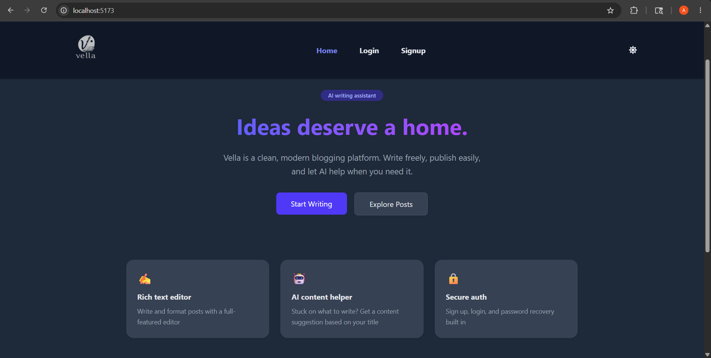
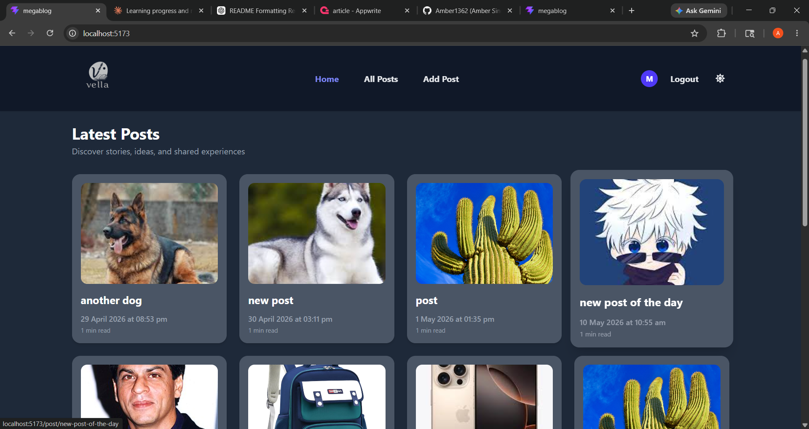
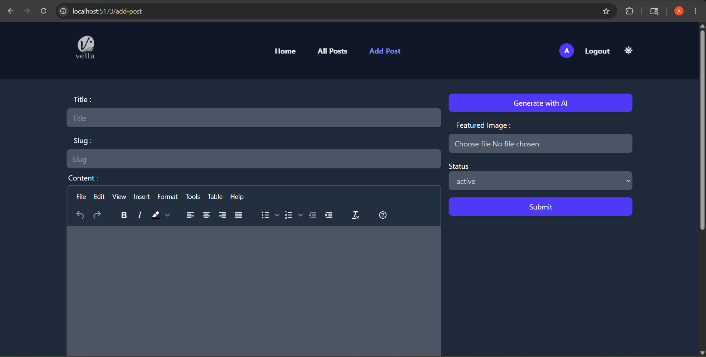
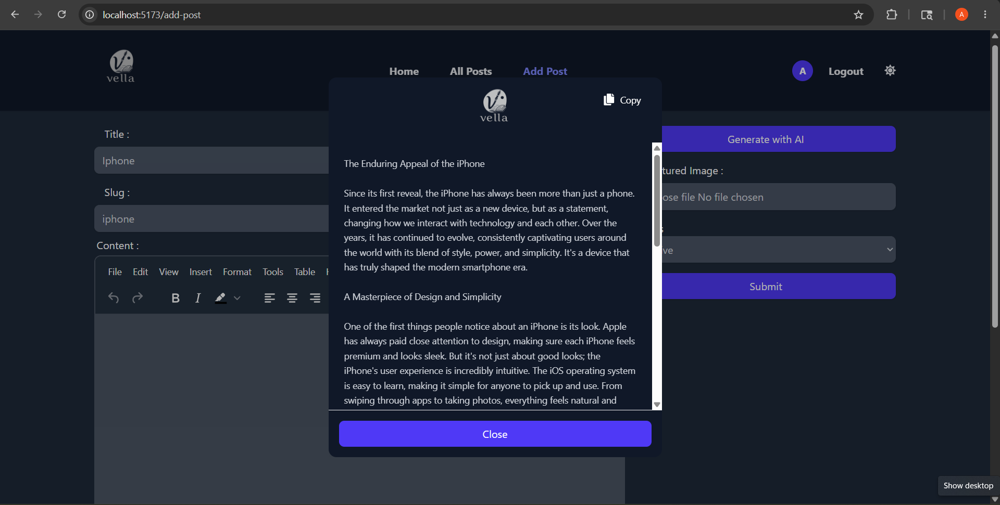
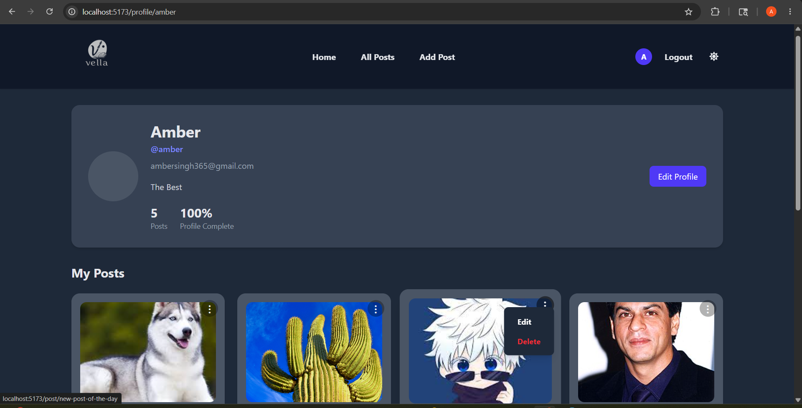

# Vella — Modern Blogging Platform

A full-stack blogging platform built with React and Appwrite, featuring AI-assisted content generation, dark mode, infinite scrolling, and a modern user experience.

## Live Demo

https://blog-app-4iu2.vercel.app

## Screenshots

### Landing Page


### Home Feed


### Create Post


### AI Content Generation


### Profile Page


## Features

### Authentication

* Email and password authentication
* Google OAuth (Sign in with Google)
* Forgot password and password reset via email
* Profile setup flow after signup
* Password visibility toggle

### Posts

* Create, edit, and delete blog posts
* Rich text editor powered by TinyMCE
* Featured image upload support
* Active and inactive post status management
* SEO-friendly slug-based URLs
* Automatic read time estimation
* Relative date formatting (Today, Yesterday, X minutes ago)

### AI Writing Assistant

* Generate blog content from a post title using Google Gemini AI
* Copy generated content to clipboard

### User Profile

* Custom username and bio setup
* View authored posts with total post count
* Edit and delete posts directly from the profile page
* Bio character counter

### Discovery

* Infinite scrolling using the Intersection Observer API
* Real-time search by post title
* Newest posts displayed first
* Guest access without requiring authentication

### User Experience

* Dark mode with localStorage persistence
* Skeleton loaders across post grids
* Toast notifications
* Framer Motion animations
* Sticky navigation header
* Mobile hamburger menu
* Hover effects and image zoom interactions
* Delete confirmation modal
* Network status detection (online/offline notifications)
* Fully responsive design

## Tech Stack

### Frontend

* React 19
* Vite
* Redux Toolkit
* React Router DOM
* React Hook Form
* Tailwind CSS v4
* TinyMCE

### Backend

* Appwrite Authentication
* Appwrite Database
* Appwrite Storage

### AI Integration

* Google Gemini API

### Libraries & Tools

* Framer Motion
* React Hot Toast
* React Loading Skeleton
* React Icons

## Run Locally

### 1. Clone the repository

```bash
git clone https://github.com/Amber1362/blog-app.git
cd blog-app
```

### 2. Install dependencies

```bash
npm install
```

### 3. Configure environment variables

Create a `.env` file in the project root and add:

```env
VITE_APPWRITE_URL=
VITE_APPWRITE_PROJECT_ID=
VITE_APPWRITE_DATABASE_ID=
VITE_APPWRITE_COLLECTION_ID=
VITE_APPWRITE_USERS_COLLECTION_ID=
VITE_APPWRITE_BUCKET_ID=
VITE_GEMINI_API_KEY=
VITE_APP_URL=http://localhost:5173
```

### 4. Start the development server

```bash
npm run dev
```

### 5. Open the application

```text
http://localhost:5173
```

## Project Structure

```text
src/
├── appwrite/      # Appwrite authentication, database and storage services
├── assets/        # Images, logos and static assets
├── components/    # Reusable UI components
├── conf/          # Environment and application configuration
├── gemini/        # Google Gemini AI integration
├── pages/         # Application pages and routes
├── store/         # Redux Toolkit store and slices
├── App.jsx        # Root application component
├── App.css
├── index.css
└── main.jsx       # Application entry point
```

## Roadmap

* User follow system
* Comments and replies
* Post bookmarking
* Post likes and reactions
* Email notifications
* Rich profile customization
* Trending posts section

## Author

Amber Singh

GitHub: https://github.com/Amber1362
