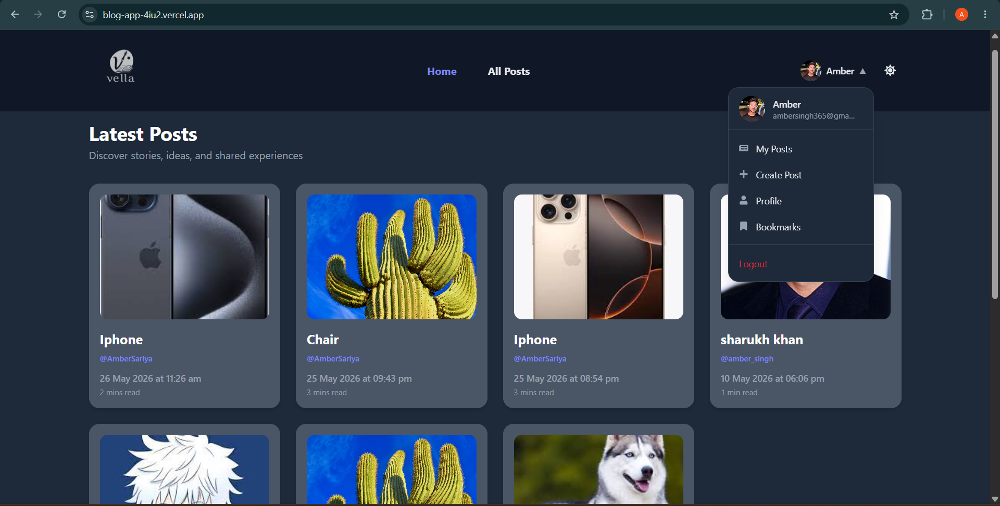
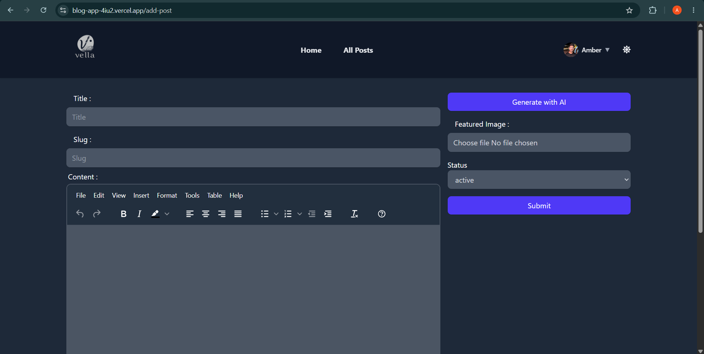
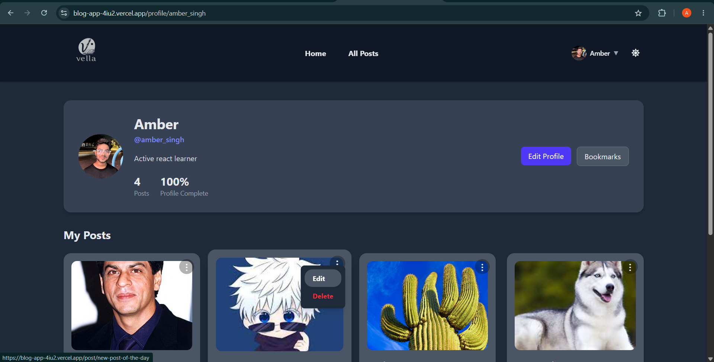

# Vella — Modern Blogging Platform

A full-stack blogging platform built with React and Appwrite, featuring AI-assisted content generation, dark mode, infinite scrolling, server-state caching, authentication persistence, and a modern user experience.

## Live Demo

https://blog-app-4iu2.vercel.app

## Screenshots

### Landing Page


### Home Feed


### Create Post


### AI Content Generation


### Profile Page


---

## Features

### Authentication

* Email and password authentication
* Google OAuth (Sign in with Google)
* Forgot password and password reset via email
* Profile setup flow after signup
* Password visibility toggle
* Protected routes using AuthLayout
* Authentication persistence using Redux Persist

### Posts

* Create, edit, and delete blog posts
* Rich text editor powered by TinyMCE
* Featured image upload support
* Active and inactive post status management
* SEO-friendly slug-based URLs
* Automatic read time estimation
* Relative date formatting (Today, Yesterday, X minutes ago)
* Like posts
* Bookmark posts
* Infinite scrolling with paginated loading
* Skeleton loading states

### AI Writing Assistant

* Generate blog content from a post title using Google Gemini AI
* Copy generated content to clipboard

### User Profile

* Custom username and bio setup
* Username uniqueness validation
* Profile photo upload support
* Edit profile page
* View authored posts with total post count
* Edit and delete posts directly from profile page
* Bio character counter

### Discovery

* Infinite scrolling using Intersection Observer API
* Real-time search by post title
* Newest posts displayed first
* Guest access without requiring authentication

### User Experience

* Dark mode with localStorage persistence
* Authentication persistence with Redux Persist
* Server-state caching using TanStack Query
* Lazy-loaded Rich Text Editor using React Lazy + Suspense
* Skeleton loaders across post grids and editor loading states
* Toast notifications
* Framer Motion animations
* Sticky navigation header
* Mobile hamburger menu
* Hover effects and image zoom interactions
* Delete confirmation modal
* Network status detection (online/offline notifications)
* Automatic recovery after reconnecting to the internet
* Fully responsive design

---

## Technical Highlights

### State Management

#### Client State

Managed using Redux Toolkit:

* Authentication state
* User information
* Theme preference

#### Server State

Managed using TanStack Query:

* Infinite post feeds
* Cached API responses
* Background refetching
* Retry handling
* Loading and error states

### Architecture Decisions

* Separate Appwrite service layer for Authentication, Database, Storage, and User Profiles
* Dedicated Users Collection for profile-specific data
* Route protection using AuthLayout
* Server-state and client-state separation using TanStack Query and Redux Toolkit
* Modular component-based architecture for scalability

---

## Performance Optimizations

* Code splitting with React.lazy and Suspense
* Lazy-loaded TinyMCE editor to reduce initial bundle size
* Authentication persistence using Redux Persist
* Server-state caching with TanStack Query
* Infinite scrolling with paginated fetching
* Skeleton loading states for perceived performance
* Network recovery handling for offline/online transitions
* Reduced unnecessary API requests through query caching
* Intersection Observer API for efficient content loading

---

## Tech Stack

### Frontend

* React 19
* Vite
* Redux Toolkit
* Redux Persist
* TanStack Query
* React Router DOM
* React Hook Form
* Tailwind CSS v4
* TinyMCE

### Backend

* Appwrite Authentication
* Appwrite Database
* Appwrite Storage

### AI Integration

* Google Gemini API

### Libraries & Tools

* Framer Motion
* React Hot Toast
* React Loading Skeleton
* React Icons
* Intersection Observer API

---

## Run Locally

### 1. Clone the repository

```bash
git clone https://github.com/Amber1362/blog-app.git
cd blog-app
```

### 2. Install dependencies

```bash
npm install
```

### 3. Configure environment variables

Create a `.env` file in the project root and add:

```env
VITE_APPWRITE_URL=
VITE_APPWRITE_PROJECT_ID=
VITE_APPWRITE_DATABASE_ID=
VITE_APPWRITE_COLLECTION_ID=
VITE_APPWRITE_USERS_COLLECTION_ID=
VITE_APPWRITE_BUCKET_ID=
VITE_GEMINI_API_KEY=
VITE_APP_URL=http://localhost:5173
```

### 4. Start the development server

```bash
npm run dev
```

### 5. Open the application

```text
http://localhost:5173
```

---

## Project Structure

```text
src/
├── appwrite/          # Appwrite authentication, database and storage services
├── assets/            # Images, logos and static assets
├── components/        # Reusable UI components
├── conf/              # Environment and application configuration
├── pages/             # Application pages and routes
├── store/             # Redux Toolkit store and slices
├── hooks/             # Custom hooks and TanStack Query hooks
├── utils/             # Utility functions
├── queryClient.js     # TanStack Query configuration
├── App.jsx            # Root application component
├── main.jsx           # Application entry point
└── index.css
```

---

## Roadmap

* User follow system
* Comments and replies
* Post reactions
* Email notifications
* Rich profile customization
* Trending posts section
* Notification center
* Draft saving
* AI-assisted post improvement

---

## Author

Amber Singh

GitHub: https://github.com/Amber1362
